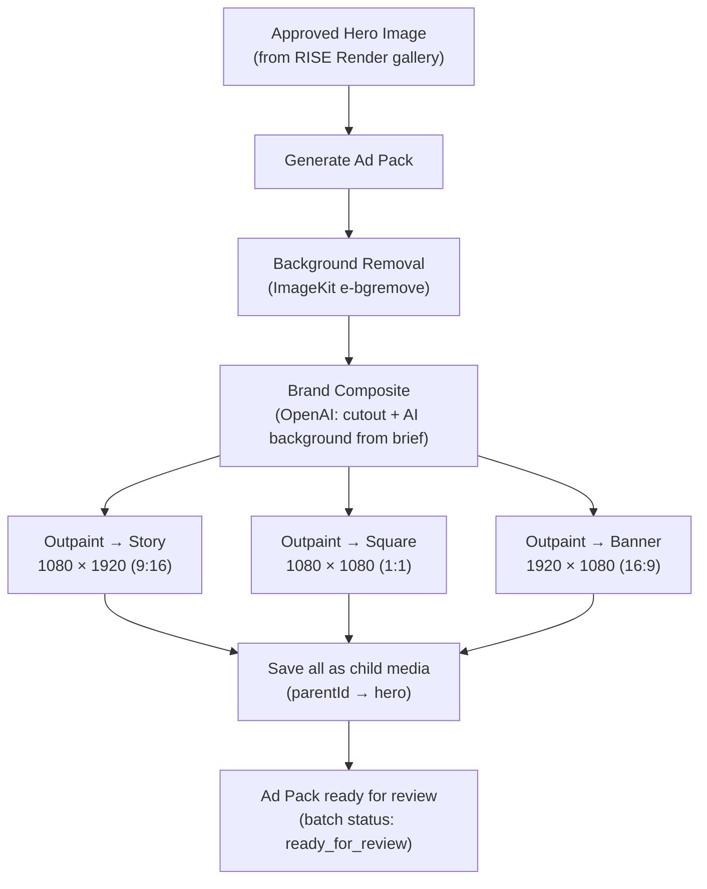

# Ad Format Pipeline — Research Extracted from Living Product Hackathon

> **Source:** `living-product-1.0.0-hackathon` (Adobe Hackathon Q1 2026, Dentsu International)
> **Purpose:** Reference material for building the ad format expansion feature in RISE Render
> **Date:** 2026-04-30

---

## 1. The Feature in One Sentence

An approved hero image feeds into a single "Generate Ad Pack" action that produces every standard advertising format via AI outpainting — not cropping — so the canvas extends naturally rather than cutting content.

---

## 2. Output Format Spec

| Format         | Dimensions    | Ratio | Channel                            | Asset Key        |
| -------------- | ------------- | ----- | ---------------------------------- | ---------------- |
| Hero Render    | 2048 × 2048   | 1:1   | Source/master                      | `hero_render`    |
| Product Cutout | (source size) | —     | Transparent PNG, bg removed        | `product_cutout` |
| Branded Hero   | 2048 × 2048   | 1:1   | Product on AI-generated background | `branded_hero`   |
| Billboard      | 1920 × 1080   | 16:9  | OOH, display advertising           | `billboard`      |
| Story          | 1080 × 1920   | 9:16  | Instagram/TikTok stories           | `story`          |
| Square         | 1080 × 1080   | 1:1   | Social feed posts                  | `square`         |
| Banner         | 1920 × 1080   | 16:9  | YouTube pre-roll, web banners      | `banner`         |
| Video          | (from hero)   | —     | 5-second motion clip               | `video`          |

### Notes

- Billboard and Banner share dimensions (1920×1080) but differ in intent — billboard is OOH, banner is digital. In practice, a single 16:9 outpaint covers both.
- Square may not need outpainting if the hero is already 1:1 — it's a downscale/crop.
- Video is a separate capability (Luma/Runway/Kling) and should be a distinct feature, not part of this pipeline.

### Formats That Matter for RISE Render (v1)

| Priority | Format           | Why                                                    |
| -------- | ---------------- | ------------------------------------------------------ |
| P0       | Story (9:16)     | Highest-volume social format                           |
| P0       | Square (1:1)     | Universal feed format                                  |
| P0       | Banner (16:9)    | Web/YouTube/display                                    |
| P1       | Billboard (16:9) | Same dimensions as banner — one generation covers both |
| P2       | Video            | Separate feature, separate API                         |

---

## 3. Pipeline Step Sequence



### Key Insight: Fan-Out After Composite

Steps E1–E3 are independent of each other. They can run as parallel OpenAI calls (3× `gpt-image-1` edit requests), reducing wall-clock time from serial 3×T to ~1×T.

---

## 4. Campaign Brief Schema

A freeform campaign brief can be parsed into structured params for prompt construction:

```typescript
type CampaignBriefParams = {
  mood: string; // e.g. "luxury", "energetic", "minimal"
  colors: string[]; // e.g. ["gold", "sunset", "warm"]
  environment: string; // e.g. "desert landscape at golden hour"
  motion_keywords: string[]; // e.g. ["slow pan", "elegant rotation"] — for future video
};
```

### How This Maps to Existing RISE Render Infra

| Brief field       | Convex `promptCategories` equivalent                  |
| ----------------- | ----------------------------------------------------- |
| `mood`            | "Mood/Lighting" category                              |
| `colors`          | No direct match — could be a new category or freeform |
| `environment`     | "Places" category                                     |
| `motion_keywords` | Future: video generation feature                      |

### Implementation Path

A "Brief Interpreter" feature could auto-populate the prompt builder dropdowns:

1. User types freeform brief in a textarea
2. Client-side call to `/api/generate` with a chat completion (not image generation)
3. OpenAI returns structured `CampaignBriefParams` JSON
4. UI auto-selects matching `promptCategories` options + fills freeform fields

---

## 5. Background Composite Prompt Template

The branded background generation prompt follows this pattern:

```
{environment}, {mood} mood, {colors} color palette, high quality, photorealistic
```

**Examples:**

- "desert landscape at golden hour, luxury mood, gold, sunset color palette, high quality, photorealistic"
- "futuristic cityscape, energetic mood, neon blues, purples color palette, high quality, photorealistic"
- "natural forest setting, organic mood, earthy greens color palette, high quality, photorealistic"

### Prompt Best Practices (for UI tooltips/onboarding)

**Good briefs include:**

- Specific environment ("sunset desert" not "outside")
- Mood keyword ("luxury", "minimal", "energetic")
- Color palette ("warm golden tones", "neon blues and purples")
- Lighting conditions ("golden hour", "soft morning light", "studio lighting")
- Style descriptor ("cinematic", "editorial", "clean")

**Anti-patterns:**

- Vague ("make it look good")
- Contradictory ("minimal but busy")
- No environment context ("professional" — professional where?)

---

## 6. Ad Pack Data Model (Convex)

### Option A: Flat — Use Existing `media` Table

Each format variant is a `media` record with `parentId` pointing to the hero:

```
hero (media)
├── cutout (media, parentId → hero, tag: "cutout")
├── branded_hero (media, parentId → hero, tag: "branded")
├── story (media, parentId → branded_hero, tag: "story")
├── square (media, parentId → branded_hero, tag: "square")
└── banner (media, parentId → branded_hero, tag: "banner")
```

**Pro:** No schema changes.
**Con:** No way to treat the pack as a unit (batch approve, batch download).

### Option B: New `adPack` Table

```typescript
// New table
adPack: defineTable({
  heroMediaId: v.id("media"), // source hero
  briefParams: v.object({
    mood: v.string(),
    colors: v.array(v.string()),
    environment: v.string(),
  }),
  status: v.union(
    v.literal("generating"),
    v.literal("ready_for_review"),
    v.literal("approved"),
    v.literal("rejected"),
  ),
  formats: v.object({
    cutout: v.optional(v.id("media")),
    branded_hero: v.optional(v.id("media")),
    story: v.optional(v.id("media")),
    square: v.optional(v.id("media")),
    banner: v.optional(v.id("media")),
  }),
  createdBy: v.string(),
});
```

**Pro:** Pack is a first-class entity. Batch operations, pack-level status, pack-level review.
**Con:** New table, new queries, new UI surface.

### Recommendation

Option B. The pack needs its own lifecycle — a reviewer approves or rejects the _set_, not individual formats. Individual `media` records still exist for per-asset editing and the existing gallery.

---

## 7. Manifest Schema (API Response Contract)

When generating an ad pack, the API should return:

```typescript
type AdPackManifest = {
  packId: string; // Convex adPack._id
  heroMediaId: string; // source hero media._id
  timestamp: string; // ISO 8601
  briefParams: CampaignBriefParams;
  assets: {
    hero_render: string; // ImageKit URL
    product_cutout: string | null;
    branded_hero: string | null;
    billboard: string | null; // same as banner in v1
    story: string | null;
    square: string | null;
    banner: string | null;
  };
  status: "generating" | "ready_for_review" | "approved" | "rejected";
};
```

`null` values indicate a format that failed generation — the pack can still be reviewed with partial results.

---

## 8. Value Proposition Framing (Portfolio Case Study)

### The Problem

Marketing teams spend **2–4 hours per product** manually creating asset variations for each advertising channel. A single hero image needs to become a story, a square post, a banner, a billboard — each requiring manual canvas extension, background filling, and export. This doesn't scale when you have a catalog of products or a weekly content cadence.

### The Solution

**One hero → complete ad pack in seconds.** Select an approved image in RISE Render, click "Generate Ad Pack," and the system AI-outpaints the hero into every standard format. The pack enters the existing approval workflow as a unit — review once, approve once, download all.

### Impact Metrics (Target)

- **Speed:** Single-digit seconds per format (parallel generation)
- **Formats:** 3–4 channel-ready assets from one source image
- **Consistency:** Same AI-extended scene across all formats
- **Integration:** Fits into existing RISE Render → review → approve pipeline

---

## 9. Implementation Sequence (Suggested)

| Phase | What                                                                                                        | Depends On           |
| ----- | ----------------------------------------------------------------------------------------------------------- | -------------------- |
| 1     | `CampaignBriefParams` type + brief interpreter endpoint (OpenAI chat completion)                            | Nothing — standalone |
| 2     | Outpaint endpoint: accept image + target dimensions, return expanded image (OpenAI `gpt-image-1` edit)      | Nothing — standalone |
| 3     | `adPack` Convex table + mutations (create, updateStatus)                                                    | Phase 2              |
| 4     | "Generate Ad Pack" button in gallery detail panel → calls outpaint for each format in parallel → saves pack | Phases 1–3           |
| 5     | Ad Pack review UI at `/internal/media` — pack-level approve/reject                                          | Phase 4              |
| 6     | Pack download (zip all formats)                                                                             | Phase 5              |

Phases 1 and 2 are independent and can be built in parallel.
